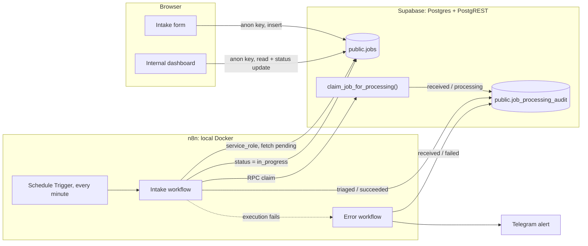

# Automated B2B project intake

> **Prototype warning:** This repository is **not production-ready**. Submit
> **synthetic test data only**. The n8n stack runs **locally**, workflows import
> as **inactive**, and the Error Workflow must be **assigned manually** in the n8n
> UI before failure handling works.
>
> **Repository branch facts (verify before deployment claims):**
> - This branch implements an **authenticated operator dashboard** with server-side
>   admin APIs.
> - **Vitest** automated tests exist in the repository.
> - **CI is not configured** in this repository.
> - A public deployment may run a **different revision**; confirm the live revision
>   before describing production behavior.

A technical prototype for incoming project requests: a Next.js form writes to
Supabase, and an optional local n8n workflow polls for pending rows, performs an
**atomic single-winner claim** with **duplicate claim suppression** for one
idempotency key, updates status, and records a technical audit trail. Processing
**may still fail after a successful claim**; a separate error workflow (when
configured) marks the open audit row as `failed` and can send a Telegram alert.

**Phase 8 (leads):** n8n polls `public.leads`, claims through versioned
`lead.created:<lead_id>:attempt:<automation_attempt>` keys, and records audit via
RPCs. Operators can manually retry failed automation from the authenticated
dashboard without deleting audit history.

## Business flow

1. A client submits a project request on the Next.js form (title, description,
   budget, priority, contact email), validated with Zod before it is sent.
2. The request is inserted into Supabase `public.jobs` with status `pending`.
3. n8n polls Supabase once a minute for pending requests, oldest first.
4. For each eligible lead it calls `claim_lead_for_processing()`, which derives
   `lead.created:<lead_id>:attempt:<automation_attempt>` server-side and inserts
   `received` / `processing` atomically.
5. On a successful claim the workflow calls `transition_lead_status()` to move the
   lead to `in_progress`.
6. The workflow writes `triaged` / `succeeded` and closes the claim through
   `complete_lead_processing()`.
7. If any step fails, the error workflow calls `fail_lead_processing()` (bounded
   technical error only), moves the lead to `needs_review`, and attempts Telegram.
8. Operators use the authenticated dashboard to review leads, update operational
   fields, and manually retry failed automation via `POST /api/admin/leads/[id]/retry`.

## Architecture



Two trust zones. The browser only ever holds the Supabase anon key and can
touch `public.jobs`. Everything technical — the RPC and the audit table — is
reachable only with the `service_role` key that lives inside n8n.

## Tech stack

| Layer | Technology |
| --- | --- |
| Frontend | Next.js (App Router), React, TypeScript, Tailwind CSS, Lucide icons |
| Forms | react-hook-form + Zod validation |
| Database | Supabase (PostgreSQL, PostgREST, RLS) |
| Automation | n8n, self-hosted via Docker Compose |
| Automation storage | PostgreSQL 16 (separate container, n8n internal state) |
| Alerting | Telegram bot (error workflow only) |

## Repository structure

```
src/
  app/            Next.js routes: intake form and /dashboard
  components/     UI primitives and job components (table, drawer, filters, toasts)
  lib/            Supabase client, data access, Zod schema, formatting helpers
  hooks/          Data-loading hooks
  types/          Job types, statuses, priorities
supabase/
  migrations/     SQL migration: audit table, constraints, RLS, claim RPC
automation/
  docker-compose.yml   Local n8n + PostgreSQL
  .env.example         Environment template, no real secrets
  workflows/           Importable n8n workflow JSON + setup guides
docs/
  supabase-processing-audit.md   Audit table, idempotency, access rights
  portfolio-case-study.md        Engineering case study
  demo-script.md                 Script for a short demo video
```

## Running it locally

### Application

```bash
npm install
npm run dev
```

- Intake form: [http://localhost:3000](http://localhost:3000)
- Internal dashboard: [http://localhost:3000/dashboard](http://localhost:3000/dashboard)

The app expects a Supabase project URL and anon key as `NEXT_PUBLIC_*`
variables in `.env.local`.

### Database

Apply `supabase/migrations/20260814000000_create_job_processing_audit.sql`
through the Supabase SQL Editor or `supabase db push`. It creates the audit
table and the claim RPC and does not modify the existing `jobs` table.
Background and manual verification queries: `docs/supabase-processing-audit.md`.

### Automation

```bash
cd automation
cp .env.example .env
docker compose --env-file .env up -d
```

- n8n UI: [http://localhost:5678](http://localhost:5678)

Setup details, including how to stop the stack without deleting data:
`automation/README.md`.

Then import the two workflows and connect credentials:

- Intake workflow: `automation/workflows/README.md`
- Lead error workflow and Telegram alerts: `automation/workflows/lead-error-handler-README.md`

## Security principles

- **`service_role` never leaves the server side.** It is stored only in n8n
  credentials, never in `NEXT_PUBLIC_*` variables, workflow JSON, Compose files
  or the browser.
- **The audit table is closed by default.** RLS is enabled with zero policies,
  and grants for `anon` and `authenticated` are explicitly revoked, so the
  frontend cannot read or write processing data. `DELETE` is granted to nobody.
- **The RPC is `SECURITY INVOKER` with a pinned `search_path`.** Even if
  `EXECUTE` were granted to the wrong role by accident, RLS would still block
  the write instead of allowing an escalated one.
- **No secrets in Git.** Only `.env.example` templates and placeholder values
  such as `YOUR_PROJECT_REF` and `YOUR_TELEGRAM_CHAT_ID` are committed.
- **Minimal data in automation.** The workflow selects only `id`, `status` and
  `created_at`, writes with `Prefer: return=minimal`, and keeps client emails,
  descriptions and payloads out of audit rows, alerts and execution logs.

## Implemented vs planned

| Area | Implemented today | Planned |
| --- | --- | --- |
| Next.js intake form + authenticated dashboard | Yes (local; public deploy revision may differ) | Hosted n8n / public webhook |
| Legacy browser → Supabase `jobs` CRUD (anon key) | Locked down in migrations | Remove legacy table |
| Audit table + claim RPC (SQL migration) | In repo; apply manually | Baseline `jobs` migration in repo |
| n8n lead intake workflow JSON | Yes; **inactive** after import | Hosted n8n / public webhook |
| n8n lead error workflow + Telegram JSON | Yes; **inactive**; Error Workflow assigned manually | — |
| Manual automation retry (dashboard API + RPC) | Yes | Automatic retry |
| Automated tests (Vitest) | Yes | — |
| CI pipeline | No | Add hosted verification in CI |
| Public webhook / Kafka | No | Future iteration |

## Current limitations

Stated explicitly:

- **Next.js is publicly deployed** (e.g. Vercel); **n8n is local only** and does
  nothing until you import workflows, configure credentials, activate polling, and
  manually assign the Error Workflow.
- **Public deployment may lag this branch.** Confirm the live revision before
  claiming dashboard auth, metrics, or automation retry behavior in production.
- **Polling, not a public webhook.** n8n polls once a minute. Supabase Database
  Webhooks would need a public HTTPS n8n endpoint.
- **No end-to-end exactly-once guarantee.** The claim RPC provides atomic
  single-winner intake and duplicate suppression for one idempotency key;
  processing may fail afterward; external side effects are not idempotent.
- **Manual retry only.** `retry_lead_automation()` requeues failed automation and
  increments `automation_attempt`; stale `processing` claims must be resolved
  separately. Legacy `public.jobs` workflows still block on `job.created:<job_id>`.
- **No message broker** (Kafka, Redpanda, etc.).
- **Vitest exists; CI does not.** SQL and n8n runtime verification remain manual.
- **Telegram** requires local bot token and chat ID in n8n credentials.

## Documented manual verification procedures

These are **manual runbook steps**, not CI-verified and not shown as applied to
production. Reproduce locally after applying the audit migration and configuring
n8n.

**1. Successful intake.** A test request is `pending`. With the intake workflow
active, it is claimed, set to `in_progress`, and leaves audit rows `received` /
`succeeded` and `triaged` / `succeeded`.

**2. Duplicate claim suppression.** A second claim with the same idempotency key
returns `false`; no duplicate `received` row. Concurrent workers get the same
behavior via the unique constraint on `(idempotency_key, step)`.

**3. Failure marks audit (requires Error Workflow assigned).** A deliberate
post-claim failure ends the run; the error handler sets `received` / `failed`.
The job may remain `pending` while the idempotency key is blocked — see
limitation above.

**4. Telegram alert (requires Telegram credential in n8n).** The error handler can
send a message with workflow name, execution ID, failing node, and a truncated
error string — no client payload or secrets.

## Documentation

| Document | Content |
| --- | --- |
| [`docs/portfolio-case-study.md`](docs/portfolio-case-study.md) | Problem, solution, engineering decisions, evidence |
| [`docs/supabase-processing-audit.md`](docs/supabase-processing-audit.md) | Audit schema, idempotency keys, access rights, verification SQL |
| [`docs/demo-script.md`](docs/demo-script.md) | Script for a 2–3 minute demo video |
| [`automation/README.md`](automation/README.md) | Local n8n Docker environment |
| [`automation/workflows/README.md`](automation/workflows/README.md) | Lead intake workflow setup |
| [`automation/workflows/lead-error-handler-README.md`](automation/workflows/lead-error-handler-README.md) | Lead error workflow and Telegram alerts |

## Short description

> B2B intake prototype: Next.js + Supabase with an authenticated operator
> dashboard on this branch, plus optional **local** n8n workflows that poll leads,
> perform atomic single-winner claims with versioned idempotency keys, and write a
> technical audit trail. Vitest covers the app layer; CI is not configured.
> Failure handling and Telegram alerts require manual n8n setup. Not
> production-ready — synthetic test data only.
