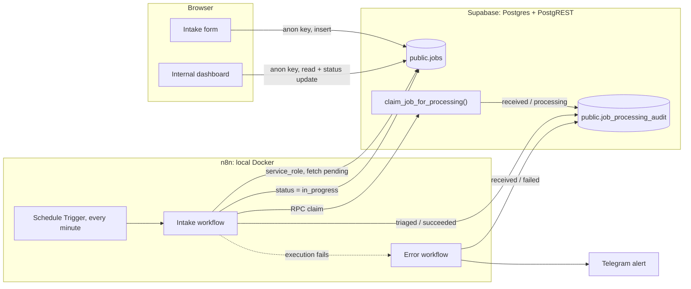

# Automated B2B project intake

A working end-to-end intake pipeline for incoming client project requests: a
Next.js form captures the request, Supabase stores it, and an n8n workflow picks
it up, claims it exactly once, moves it into processing and records a technical
audit trail. When automation breaks, a dedicated error workflow closes the open
claim and sends a Telegram alert.

The point of this repository is not the form. It is what happens after the form:
idempotent intake, an auditable processing trail, and failure handling that
leaves no request silently stuck.

## Business flow

1. A client submits a project request on the Next.js form (title, description,
   budget, priority, contact email), validated with Zod before it is sent.
2. The request is inserted into Supabase `public.jobs` with status `pending`.
3. n8n polls Supabase once a minute for pending requests, oldest first.
4. For each request it calls the Postgres RPC `claim_job_for_processing()`,
   which atomically writes a `received` / `processing` audit row. The first
   caller wins and gets `true`; any repeat gets `false` and stops.
5. On a successful claim the job status moves to `in_progress`.
6. The workflow writes a `triaged` / `succeeded` audit row and closes the intake
   claim by moving `received` from `processing` to `succeeded`.
7. If any step fails, the error workflow marks the open claim as `failed` with a
   short technical reason and sends a Telegram notification.
8. An internal dashboard shows all requests with search, filters and status
   updates.

## Architecture



Two trust zones. The browser only ever holds the Supabase anon key and can
touch `public.jobs`. Everything technical — the RPC and the audit table — is
reachable only with the `service_role` key that lives inside n8n.

## Tech stack

| Layer | Technology |
| --- | --- |
| Frontend | Next.js (App Router), React, TypeScript, Tailwind CSS, Lucide icons |
| Forms | react-hook-form + Zod validation |
| Database | Supabase (PostgreSQL, PostgREST, RLS) |
| Automation | n8n, self-hosted via Docker Compose |
| Automation storage | PostgreSQL 16 (separate container, n8n internal state) |
| Alerting | Telegram bot (error workflow only) |

## Repository structure

```
src/
  app/            Next.js routes: intake form and /dashboard
  components/     UI primitives and job components (table, drawer, filters, toasts)
  lib/            Supabase client, data access, Zod schema, formatting helpers
  hooks/          Data-loading hooks
  types/          Job types, statuses, priorities
supabase/
  migrations/     SQL migration: audit table, constraints, RLS, claim RPC
automation/
  docker-compose.yml   Local n8n + PostgreSQL
  .env.example         Environment template, no real secrets
  workflows/           Importable n8n workflow JSON + setup guides
docs/
  supabase-processing-audit.md   Audit table, idempotency, access rights
  portfolio-case-study.md        Engineering case study
  demo-script.md                 Script for a short demo video
```

## Running it locally

### Application

```bash
npm install
npm run dev
```

The app expects a Supabase project URL and anon key as `NEXT_PUBLIC_*`
variables in `.env.local`. Open <http://localhost:3000> for the intake form and
<http://localhost:3000/dashboard> for the internal view.

### Database

Apply `supabase/migrations/20260814000000_create_job_processing_audit.sql`
through the Supabase SQL Editor or `supabase db push`. It creates the audit
table and the claim RPC and does not modify the existing `jobs` table.
Background and manual verification queries: `docs/supabase-processing-audit.md`.

### Automation

```bash
cd automation
cp .env.example .env
docker compose --env-file .env up -d
```

n8n runs on <http://localhost:5678>. Setup details, including how to stop the
stack without deleting data: `automation/README.md`.

Then import the two workflows and connect credentials:

- Intake workflow: `automation/workflows/README.md`
- Error workflow and Telegram alerts: `automation/workflows/error-handler-README.md`

## Security principles

- **`service_role` never leaves the server side.** It is stored only in n8n
  credentials, never in `NEXT_PUBLIC_*` variables, workflow JSON, Compose files
  or the browser.
- **The audit table is closed by default.** RLS is enabled with zero policies,
  and grants for `anon` and `authenticated` are explicitly revoked, so the
  frontend cannot read or write processing data. `DELETE` is granted to nobody.
- **The RPC is `SECURITY INVOKER` with a pinned `search_path`.** Even if
  `EXECUTE` were granted to the wrong role by accident, RLS would still block
  the write instead of allowing an escalated one.
- **No secrets in Git.** Only `.env.example` templates and placeholder values
  such as `YOUR_PROJECT_REF` and `YOUR_TELEGRAM_CHAT_ID` are committed.
- **Minimal data in automation.** The workflow selects only `id`, `status` and
  `created_at`, writes with `Prefer: return=minimal`, and keeps client emails,
  descriptions and payloads out of audit rows, alerts and execution logs.

## Current limitations

Stated explicitly, because a portfolio project should not oversell itself:

- **Polling, not a public webhook.** n8n asks Supabase for new rows once a
  minute. Supabase Database Webhooks would need a public HTTPS endpoint, which
  this setup does not have.
- **No public deployment.** Everything runs locally: the app on `localhost:3000`
  and n8n in Docker on `localhost:5678`.
- **No message broker.** There is no Kafka, Redpanda or queue in this project.
- **Manual verification only.** Scenarios below are reproducible by hand; there
  is no automated test suite or CI pipeline yet.
- **Telegram requires local setup.** The bot token and chat ID are configured in
  n8n after import, never committed.

## Verified scenarios

Each scenario is reproducible locally with the documented steps and confirmed
with SQL against Supabase.

**1. Successful intake.** A new request appears as `pending`. The workflow
claims it, sets `in_progress` and leaves two audit rows: `received` /
`succeeded` and `triaged` / `succeeded`, both tagged with the n8n execution ID.

**2. Duplicate-safe claim.** Running the workflow again for the same request
makes `claim_job_for_processing()` return `false`. Execution stops on the false
branch: no second claim, no duplicate audit rows, no repeated status update.
The guarantee is a unique constraint on `(idempotency_key, step)` with intake
using `job.created:<job_id>`, so concurrent workers and retries collide in the
database rather than in application logic.

**3. Failure marks the audit trail.** When a node after the claim fails — the
documented test points one URL at a non-existent endpoint — the run ends with an
error and the error workflow flips the open `received` row from `processing` to
`failed`, storing the failing node name and a truncated error message. A row
left in `processing` therefore always means "started and never finished", which
is exactly what monitoring should look for.

**4. Telegram error notification.** The same failure delivers a Telegram message
containing only the workflow name, execution ID, failing node and a shortened
error string. No client data, no credentials.

## Documentation

| Document | Content |
| --- | --- |
| [`docs/portfolio-case-study.md`](docs/portfolio-case-study.md) | Problem, solution, engineering decisions, evidence |
| [`docs/supabase-processing-audit.md`](docs/supabase-processing-audit.md) | Audit schema, idempotency keys, access rights, verification SQL |
| [`docs/demo-script.md`](docs/demo-script.md) | Script for a 2–3 minute demo video |
| [`automation/README.md`](automation/README.md) | Local n8n Docker environment |
| [`automation/workflows/README.md`](automation/workflows/README.md) | Intake workflow setup |
| [`automation/workflows/error-handler-README.md`](automation/workflows/error-handler-README.md) | Error workflow and Telegram alerts |

## Short description

> Automated B2B project-intake pipeline: a Next.js + Supabase request form feeds
> an n8n workflow that claims each request exactly once through a Postgres RPC,
> updates its status and writes a full audit trail. Failures are caught by a
> dedicated error workflow that marks the claim as failed and sends a Telegram
> alert. Built with idempotency, row-level security and least-privilege access
> keys as first-class concerns, and documented so a client can run it end to end.
