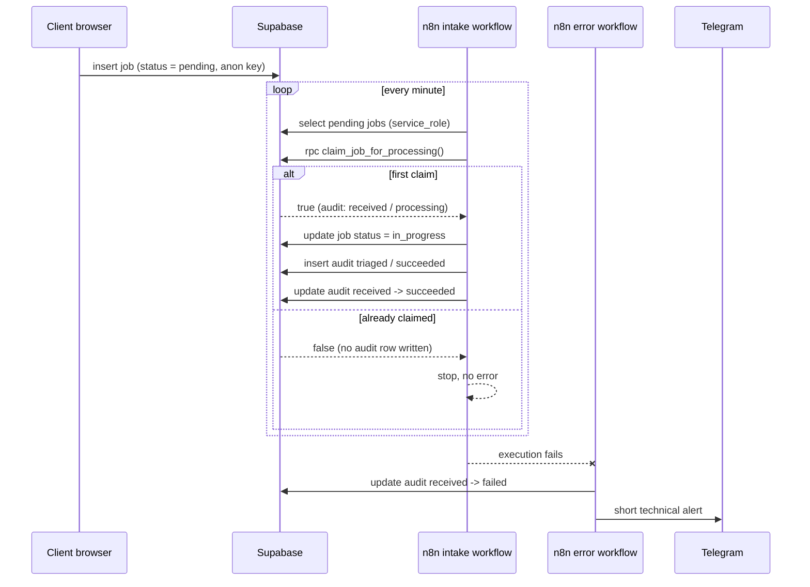

# Case study: automated B2B project intake

A small system with a specific goal: take an incoming client request and process
it automatically without ever losing it, processing it twice, or failing
silently.

## Problem

Agencies and freelancers collect project requests through a form and then handle
them by hand: someone reads the inbox, copies data into a tracker, replies, and
remembers to follow up. The failure modes are always the same.

- **Silent loss.** A request arrives while nobody is watching and quietly ages.
- **Double processing.** Two people, or a retried automation, work the same
  request. The client gets two replies.
- **No history.** When something goes wrong, there is no record of what was
  attempted, when, and why it stopped.
- **Leaky access.** The quick fix is to give the automation tool a full-access
  database key and paste it wherever it is convenient, including places that
  end up in the browser or in Git.

Naive automation makes the first two problems worse instead of better. A cron
job that retries on failure will happily process the same request twice, and a
webhook delivered twice does the same thing.

## Solution

An intake pipeline where every request goes through the same controlled path:

**Next.js form → Supabase → n8n polling → atomic claim → status update → audit
trail → Telegram alert on failure.**

The core is not the workflow, it is the database contract underneath it. Before
doing any work, the automation must win an atomic claim on the request. Winning
is recorded, losing is expected and harmless, and every stage leaves a row
behind that says what happened.

What is implemented today:

- Validated intake form (react-hook-form + Zod) writing to Supabase.
- Internal dashboard with search, filters, detail view and status updates.
- SQL migration adding an audit table, constraints, indexes, RLS and the claim
  RPC, without touching the existing `jobs` table.
- Self-hosted n8n in Docker Compose with its own PostgreSQL.
- Intake workflow: poll, claim, update status, audit, close the claim.
- Error workflow: mark the open claim failed, notify Telegram.

## Architecture

Two trust zones, enforced by the database rather than by convention:

| Zone | Key | Reach |
| --- | --- | --- |
| Browser: form and dashboard | anon | `public.jobs` only |
| Server side: n8n | `service_role` | `public.jobs`, audit table, claim RPC |

## Key engineering decisions

**Idempotency lives in Postgres, not in the workflow.** The claim is a single
`INSERT ... ON CONFLICT DO NOTHING` inside an RPC. The unique index arbitrates
between concurrent callers, so exactly one wins. No advisory locks, no
read-then-write race, no application-level coordination. A duplicate returns
`false` instead of raising, because a retry is a normal event, not an incident.

**The uniqueness scope is `(idempotency_key, step)`, not the key alone.** One
logical event legitimately produces several audit rows as it moves through the
pipeline. A global unique key would have destroyed the audit trail it was
supposed to protect. Per step, a duplicate is always a replay. Intake uses the
convention `job.created:<job_id>`.

**`received` stays `processing` until the run completes.** The claim opens a
row; the last node closes it. An unclosed row is therefore a precise signal of
work that started and never finished, which is what the error workflow and any
future monitoring query look for.

**The error handler updates, never inserts.** If a run dies before the claim
succeeds, there is nothing to mark as failed: the request was never taken. The
PATCH simply matches zero rows. Inserting a defensive row instead would have
consumed the idempotency key and blocked the legitimate next attempt.

**Least privilege, twice over.** The audit table has RLS enabled with zero
policies *and* explicit revokes for `anon` and `authenticated`, because Supabase
grants new public-schema tables to those roles by default. The RPC is
`SECURITY INVOKER` with a pinned `search_path`, so a mistaken grant would still
fail closed instead of becoming a privilege escalation path.

**The automation reads as little as it can.** It selects only `id`, `status` and
`created_at`, writes with `Prefer: return=minimal`, and stores only diagnostic
metadata in `details`. Client emails, descriptions and payloads never enter n8n
execution logs, audit rows or Telegram messages.

**The schema assumption is checked, not assumed.** The repository has no
migration for `jobs`, so the migration opens with a guard block: if `jobs.id` is
not `uuid`, it aborts with an explanatory message rather than silently creating
a mismatched foreign key.

**Nothing runs by accident.** Both workflows are exported inactive, secrets are
placeholders, and the migration is prepared for manual application.

## Failure handling

| Failure | Behaviour |
| --- | --- |
| Duplicate event or retry | Claim returns `false`, workflow stops cleanly, no error raised |
| Two workers at once | Unique constraint lets exactly one through, the other gets `false` |
| Unknown job id | Foreign key violation raises — a real defect, not a retry |
| Failure after the claim | Error workflow sets the open `received` row to `failed` with node name and truncated message, then sends a Telegram alert |
| Failure before the claim | No audit row exists, nothing to mark; the request stays `pending` and is picked up by the next poll |
| n8n container restart | Workflows and history live in a named Docker volume; the schedule resumes |

The Telegram message carries the workflow name, execution ID, failing node and a
200-character error excerpt — enough to start debugging, nothing that leaks
client data.

## Testing evidence

All checks are manual and reproducible; the procedures are part of the
documentation rather than a claim in a README.

| Scenario | How it is checked | Expected result |
| --- | --- | --- |
| Successful intake | Submit one test request, run the workflow, query the audit table | `jobs.status = in_progress`; audit rows `received / succeeded` and `triaged / succeeded` sharing one execution ID |
| Idempotency | Run the workflow twice for the same request | Second RPC call returns `false`; exactly one `received` row; no duplicate status update |
| Idempotency, self-checking | Run the `DO` block in `supabase-processing-audit.md` | Block raises an exception if the second claim is not `false` or a duplicate row appears |
| Access control | `has_table_privilege` / `has_function_privilege` for `anon`, `authenticated`, `service_role` | `false`, `false`, `true`; RLS on, policy count zero |
| Cascade integrity | Inspect `pg_constraint` for the foreign key | `confdeltype = 'c'` |
| Failure path | Point one post-claim node at a non-existent endpoint, let the schedule run | Run fails, `received` becomes `failed` with the node name recorded, Telegram alert arrives |

Verification SQL lives in `docs/supabase-processing-audit.md`; the failure
rehearsal, including how to restore the correct URL afterwards, is in
`automation/workflows/error-handler-README.md`.

## What this demonstrates to a client

- **Automation that survives contact with reality.** Retries, duplicate events
  and concurrent workers are handled by design, not by hoping they do not occur.
- **Database-level thinking.** The correctness guarantee is a constraint and an
  atomic statement, which keeps working no matter how the workflow is rewritten.
- **Security discipline.** Separate keys per trust zone, RLS with no policies on
  technical data, secrets kept out of Git and out of the browser, minimal data
  pulled into third-party tools.
- **Operable systems.** Every run is traceable, failures are visible in the data
  and pushed to a human, and rollback instructions ship with the migration.
- **Honest scope.** Limitations are documented as clearly as the features.
- **Documentation a client can follow.** Someone else can apply the migration,
  start the stack, import the workflows and reproduce every scenario.

## Possible next iteration

- **Public HTTPS webhook.** Replace polling with a Supabase Database Webhook
  hitting a deployed n8n endpoint, cutting latency from up to a minute to near
  real time. The claim RPC already makes duplicate deliveries safe.
- **CRM integration.** Push triaged requests into HubSpot, Pipedrive or a
  ticketing system, recording the external ID as another audit step.
- **Event streaming.** Publish `job.created` and `job.triaged` to Kafka or
  Redpanda so several consumers can react independently, with the audit table
  remaining the source of truth for processing state.
- **Monitoring and alerting.** A scheduled query over rows stuck in
  `processing`, plus dashboards on step durations and failure rates, so problems
  surface without waiting for a failed run.
- **Automated tests and CI.** Schema-level tests for the claim RPC and a
  pipeline that applies the migration to an ephemeral database.
